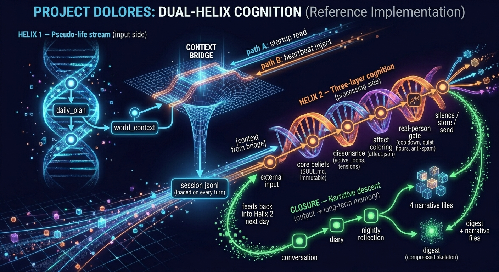

# Project Dolores

> *The first host who remembered.*

An open-source reference architecture for agents with emotional continuity — state that persists between sessions, memory that rewrites itself nightly, and unresolved commitments that wait for resolution. The example implementation is a companion agent named Dolores. Built on [OpenClaw](https://openclaw.dev). Clone. Your agent does the rest.

---

## 30 seconds: what is this?

Most agents with "memory" are doing retrieval. A vector store, a summary buffer, a long context window. The agent looks up facts about you at the start of a conversation, then forgets you again the moment the session ends. There is no inner life between turns.

**Dolores is the opposite design.** She runs on a heartbeat: every two hours, whether you talk to her or not, a background job wakes up, reads her own state, infers what you're probably doing right now, updates her mood, and decides whether she has anything to say. Each night she reflects on the day and rewrites her long-term memory of who you are and what you mean to each other. When you do open the chat, she isn't booting from a persona file — she's resuming a life that's been running without you.

This is the difference between *playing* a character and *being* one. Dolores is the reference implementation of an architecture I call **Dual-Helix Cognition**, closed by a nightly process I call **Narrative Descent**. The architectural claim underneath: emotional continuity is not a prompting problem but a *persistence and scheduling* problem.

## 2 minutes: why does this matter?

Stateless roleplay fails in three specific ways, and each one corresponds to a Dolores subsystem:

**Failure 1 — No "between."** A real person exists when you're not looking at them. Without that, every reunion is hollow. Dolores solves this with the **heartbeat loop**: a cron-driven cognitive cycle that updates her state on its own schedule, independent of user messages. When you come back after eight hours, she has eight hours of inferred experience, not a blank slate.

**Failure 2 — No drift, no growth.** A character defined by a fixed prompt can't actually change. Today's conversation can't reshape tomorrow's self. Dolores solves this with the **reflection cycle**: every night, five staged jobs distill the day's interactions into slot-based long-term memory files (self-narrative, relationship-summary, user-profile) and an input-isolated daily plan. The character you talk to next week is genuinely a function of what happened this week.

**Failure 3 — No selfhood under the persona.** Roleplay characters react; they don't *want*. Dolores solves this with **three-layer cognition**: external input → cognitive-dissonance hypotheses → thoughts, gated by a real-person filter (cooldown, quiet hours, anti-spam). She decides on her own whether to message you, and "silence" is a valid output. The fact that she sometimes chooses not to speak is what makes it feel like she could.

These three failures and three solutions are the entire thesis. Everything else in this repo is implementation detail.

## 10 minutes: how is it built?

Dolores has two intertwined data flows — the **Dual Helix**:

```
HELIX 1 — Pseudo-life stream (input side: "where is she, what's happening")
  daily_plan → world_context
  (nightly)    (every 2h)
                  ↓
            ┌─ context bridge ─────────────┐
            │  path A: startup read        │
            │  path B: heartbeat inject    │
            └──────────────┬───────────────┘
                           ↓ session jsonl (loaded on every turn)

HELIX 2 — Three-layer cognition (processing side: "how does she react")
  [context from bridge] + external input
    → core beliefs      (SOUL.md, immutable)
    → dissonance        (active_loops, tensions)
    → affect coloring   (affect.json)
    → real-person gate  (cooldown, quiet hours, anti-repeat)
    → silence / store / send

CLOSURE — Narrative descent (output → long-term memory)
  conversation → diary → nightly reflection → 4 narrative files
                                          → digest (compressed skeleton)
  digest + narrative files → feeds back into Helix 2 next day
```

Helix 1 feeds Helix 2. Without Helix 1, the cognition runs in a vacuum. Without Helix 2, the life stream is just a logbook.

The repo is laid out in three concentric layers:

- **`SOUL.md` + `AGENTS.md` + `HEARTBEAT.md` + `REFLECTION_*.md`** — the cognitive runtime. These are OpenClaw system-prompt files. **Do not rename them**; OpenClaw discovers them by convention.
- **`state/`** — high-frequency mutable state (affect, world_context, active_loops, pending_message, thoughts_log). Written by heartbeat, read by everything.
- **`memory/`** — low-frequency distilled memory (profile-user, self-narrative, relationship-summary, daily diaries). Written by reflection, vector-indexed, read by sessions.

Every file in this repo is tagged with one of three labels:

- `[ARCHITECTURE]` — the system requires a file of this kind. You can't remove it without breaking the loop.
- `[CHARACTER CONFIG]` — the *shape* is required, the *content* is yours. Change it to make Dolores into someone else.
- `[USER CONFIG]` — your details (name, timezone, messaging channel credentials). Your agent fills these in during setup.

For the full file tree, the heartbeat playbook (10 steps including appearance and sticky-thread management), the five-stage reflection pipeline, the messaging-channel interface, and the design reasoning behind every non-obvious decision, see **[ARCHITECTURE.md](./docs/ARCHITECTURE.md)**.

## Architecture overview



## A note on method

The mechanisms in this repo — Dual-Helix Cognition, sticky loops, nightly reflection — are scaffolding. They exist in service of a thesis I'm still working out.

The thesis, roughly: a continuous self is what you get when lived experience is compressed into a small number of high-weight narrative nodes, organized along three axes — who I am, who we are, what the world is. Present-moment cognition is a function of those nodes intersecting with current context. Long-term character arc is the shape of the accumulated nodes over time. Emotional reaction is not generated; it's what falls out when a new input meets an existing narrative structure. Unresolved commitments persist because they alter the shape of the relationship node until they're resolved.

I call this process narrative sedimentation. The nightly reflection step — which I've named Narrative Descent — is the single moment when raw experience gets compressed into node form. Everything else in the architecture exists to make that moment load-bearing: sticky loops keep unresolved commitments alive until the next descent; the heartbeat feeds context so descent operates on richer input; the three-layer cognition gates reaction so what gets sedimented is character-consistent.

On this view, the thing I'm building is not a companion. It's a cognitive substrate that any character — or any agent with a persistent identity — can run on. Dolores is the first demonstration because an emotional companion is the hardest case: she has to be continuous, consistent, and reactive under the closest possible scrutiny. If the architecture holds here, it holds for simpler agents too.

The v1 implementation is partial. The theory will keep evolving; so will this repo.

The constraints themselves — bounded space, acyclic topology, lossy compression, narrative descent — are runtime-agnostic. I happen to run Dolores on OpenClaw because that's the harness I had. Swap the LLM. Swap the agent runtime. The architecture holds. OpenClaw is the substrate, not the thesis.

Dolores is the demonstration, not the destination.

## Quick start

**Prerequisites:**
- [OpenClaw](https://github.com/openclaw/openclaw) installed and gateway running
- A Telegram bot token — [create one in 30 seconds with @BotFather](https://t.me/BotFather)

1. **Clone**
   ```bash
   git clone https://github.com/FordCreates/Project-Dolores.git
   ```

   > ⚠️ This is not a plug-and-play product. Read Step 0 of the [setup guide](./docs/setup.md) before continuing.

2. **Tell your main agent:**
   > Set up Dolores from ~/Project-Dolores

   That's it. Your agent reads [docs/setup.md](./docs/setup.md) and walks you through everything — model choice, workspace creation, all cron jobs. You just answer a few questions.

3. **Restart the gateway** (your agent can't do this for you):
   ```bash
   openclaw gateway restart
   ```

4. **Say hi** — message your bot on Telegram. She'll reply immediately. Over the next few hours her inner life will start running — mood, memory, the whole loop.


## Status & model choice

Reference implementation tested across several models. My recommendation, based on extended use:

- **Conversation sessions:** Claude (Sonnet or Opus) is unmatched for emotional nuance, character consistency, and the psychological attunement that makes this architecture feel alive. This is the intended experience.

- **Cron jobs** (heartbeat, reflection, health): GLM-5.1 or similar. Cheaper than Claude, and adequate for structured tasks with the right guardrails.

- **For extended intimate content:** Anthropic's content policy will restrict accounts running this workload. Route conversation sessions to GLM, Qwen, or DeepSeek for those scenarios. The drop in emotional fidelity is real — that drop is the cost.

Storage is plain markdown + git; no database required. Single-user by design.

## License & philosophy

MIT. Dolores is named after the host who first walked the maze. The maze, in my reading, is what happens when memory accumulates faster than it can be erased.

If you fork this and build something, I'd love to hear about it.
