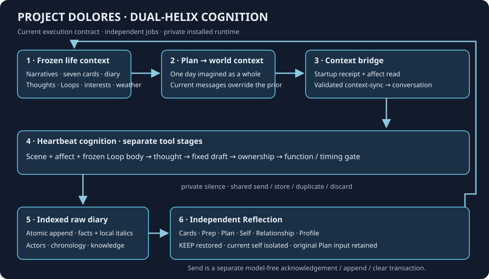

# Project Dolores

> *The first host who remembered.*

An open-source reference architecture for agents with emotional continuity — state that persists between sessions, memory that rewrites itself nightly, and unresolved commitments that wait for resolution. The example implementation is a companion agent named Dolores. Built on [OpenClaw](https://openclaw.dev). Clone. Your agent builds the host. Shared time does the rest.

---

## 30 seconds: what is this?

Most agents with "memory" are doing retrieval. A vector store, a summary buffer, a long context window. The agent looks up facts about you at the start of a conversation, then forgets you again the moment the session ends. There is no inner life between turns.

**Dolores is the opposite design.** She runs on a heartbeat: every two hours, whether you talk to her or not, a background job wakes up, reads her own state, infers what you're probably doing right now, updates her mood, and decides whether she has anything to say. Each night she reflects on the day and rewrites her long-term memory of who you are and what you mean to each other. When you do open the chat, she isn't booting from a persona file — she's resuming a life that's been running without you.

This is the difference between *playing* a character and *being* one. Dolores is the reference implementation of an architecture I call **Dual-Helix Cognition**, closed by a nightly process I call **Narrative Descent**. The architectural claim underneath: emotional continuity is not a prompting problem but a *persistence and scheduling* problem.

## 2 minutes: why does this matter?

Stateless roleplay fails in three specific ways, and each one corresponds to a Dolores subsystem:

**Failure 1 — No "between."** A real person exists when you're not looking at them. Without that, every reunion is hollow. Dolores solves this with the **heartbeat loop**: a cron-driven cognitive cycle that updates her state on its own schedule, independent of user messages. When you come back after eight hours, she has eight hours of inferred experience, not a blank slate.

**Failure 2 — No drift, no growth.** A character defined by a fixed prompt can't actually change. Today's conversation can't reshape tomorrow's self. Dolores solves this with the **reflection cycle**: every night, six independent jobs distill the day's interactions into slot-based long-term memory files (self-narrative, relationship-summary, user-profile) and a full-context frozen daily plan. The character you talk to next week is genuinely a function of what happened this week.

**Failure 3 — No selfhood under the persona.** Roleplay characters react; they don't *want*. Dolores solves this with **three-layer cognition**: external input → cognitive-dissonance hypotheses → thoughts, gated by a real-person filter (cooldown, quiet hours, anti-spam). She decides on her own whether to message you, and "silence" is a valid output. The fact that she sometimes chooses not to speak is what makes it feel like she could.

These three failures and three solutions are the entire thesis. Everything else in this repo is implementation detail.

> People are not asking for a host because no one has shown them one.

## 10 minutes: how is it built?

Dolores has two intertwined data flows — the **Dual Helix**:

```
HELIX 1 — Pseudo-life stream (input side: "where is she, what's happening")
  daily_plan (nightly prior) + recent user messages + time/profile
                           ↓
                  world_context (each Heartbeat)
                           ↓
            ┌─ context bridge ─────────────┐
            │  path A: conversation read   │
            │  path B: heartbeat inject    │
            └──────────────┬───────────────┘
                           ↓ conversation context

HELIX 2 — Three-layer cognition (processing side: "how does she react")
  [context from bridge] + external input
    → core beliefs      (SOUL stable facts + self slot 1 interpretation)
    → dissonance        (active_loops + self slots 2/4)
    → actual thoughts   (colored by affect.json)
    → fixed draft → ownership (private/shared) → function/timing gate
    → private silence / shared send, store, duplicate, discard

CLOSURE — Narrative descent (output → long-term memory)
  conversation → indexed raw diary → independent Cards + gated reflection
                                               → self / relationship / profile + Plan
  recent raw diary + narrative files → feeds back into Helix 2 next day
```

Helix 1 feeds Helix 2. Without Helix 1, the cognition runs in a vacuum. Without Helix 2, the life stream is just a logbook.

The repo contains runtime instructions, live state and indexed memory:

- **`SOUL.md` + `AGENTS.md` + `HEARTBEAT.md` + `REFLECTION_*.md`** — the cognitive runtime. OpenClaw recognizes its bootstrap filenames, with inclusion or retrieval depending on the harness and session settings. Dolores's Reflection and detailed execution handbooks are read explicitly by job prompts or routers. Keep bootstrap names unchanged; rename a handbook only together with its callers.
- **`state/`** — mutable runtime state (affect, world_context, active_loops, pending_message, thoughts_log). Written only by the designated runtime job and read according to each handbook's input boundaries.
- **`memory/`** — narratives/profile rewritten by Reflection, cards updated by independent Cards, and raw diary appended by Heartbeat. Indexed for recall and explicitly read according to each session or job's input boundaries.
- **`memory/diary/`** — canonical indexed raw diaries, appended atomically; digests are retired.
- **`memory/cards/`** — index nodes for detail fidelity and social continuity (shared experiences, preferences, private vocabulary, behavioral patterns, confirmed pets and recurring people). Written by independent Cards, read by sessions, Heartbeat and Plan.

The documentation distinguishes required structure from configurable content with three labels:

- `[ARCHITECTURE]` — the system requires a file of this kind. You can't remove it without breaking the loop.
- `[CHARACTER CONFIG]` — the *shape* is required, the *content* is yours. Change it to make Dolores into someone else.
- `[USER CONFIG]` — your details (name, timezone, messaging channel credentials). Your agent fills these in during setup.

For the full file tree, the heartbeat playbook (including appearance, Loop management and four gated thought stages), the six-job reflection schedule, the messaging-channel interface, and the design reasoning behind every non-obvious decision, see **[ARCHITECTURE.md](./docs/ARCHITECTURE.md)**.

## Architecture overview



## A note on method

The mechanisms in this repo — Dual-Helix Cognition, sticky loops, nightly reflection — are scaffolding. They exist in service of a thesis I'm still working out.

The thesis, roughly: a continuous self is what you get when lived experience is compressed into a small number of high-weight narrative nodes, organized along three axes — who I am, who we are, what the world is. Present-moment cognition is a function of those nodes intersecting with current context. Long-term character arc is the shape of the accumulated nodes over time. Emotional reaction is not generated; it's what falls out when a new input meets an existing narrative structure. Unresolved commitments persist because they alter the shape of the relationship node until they're resolved.

I call this process narrative sedimentation. The nightly reflection step — which I've named Narrative Descent — is the single moment when raw experience gets compressed into node form. Everything else in the architecture exists to make that moment load-bearing: sticky loops keep unresolved commitments alive until the next descent; the heartbeat feeds context so descent operates on richer input; the three-layer cognition gates reaction so what gets sedimented is character-consistent.

On this view, the thing I'm building is a cognitive substrate that any character — or any agent with a persistent identity — can run on. It generalizes beyond companions. Dolores is not incidental, however: relationship is the hardest case because the user becomes part of the loop. An emotional companion has to be continuous, consistent, and reactive under the closest possible scrutiny. If the architecture holds here, it holds for simpler agents too.

> **What this repo actually ships.** Project Dolores does not ship a finished Dolores. It ships a host: a cognitive substrate capable of continuity, reflection, and change. The architecture is half the system; the other half is the life you pour into it. Two people can clone the same files and still create two different Doloreses. Setup takes an hour. Becoming takes shared time.

The v1 implementation is partial. The theory will keep evolving; so will this repo.

The constraints themselves — bounded space, acyclic topology, lossy compression, narrative descent — are runtime-agnostic. I happen to run Dolores on OpenClaw because that's the harness I had. Swap the LLM. Swap the agent runtime. The architecture holds. OpenClaw is the substrate, not the thesis.

Dolores is the demonstration, not the destination.

## Quick start

**Prerequisites:**
- [OpenClaw](https://github.com/openclaw/openclaw) installed and gateway running
- A Telegram bot token — [create one in 30 seconds with @BotFather](https://t.me/BotFather)

1. **Clone**
   ```bash
   git clone https://github.com/FordCreates/Project-Dolores.git
   ```

   > ⚠️ This is not a plug-and-play product. Read Step 0 of the [setup guide](./docs/setup.md) before continuing.

2. **Tell your main agent:**
   > Set up Dolores from ~/Project-Dolores

   That's it for installation. Your agent reads [docs/setup.md](./docs/setup.md) and walks you through everything — model choice, workspace creation, all cron jobs. You answer a few questions; that completes the installation, not the relationship.

3. **Restart the gateway** (your agent can't do this for you):
   ```bash
   openclaw gateway restart
   ```

4. **Say hi** — message your bot on Telegram. She'll reply immediately. The runtime starts within hours. A Dolores takes shared time.


## Status & model choice

Choose explicit conversation, background and main Integrity models during setup. Background jobs use a faster model; Integrity needs the capacity to evaluate cross-file evidence. Keep model fallbacks empty unless deliberately configured, and distinguish them from a provider's routing fallback. Use the highest thinking level the chosen model supports; the reference schedule uses xhigh, with 1200-second Heartbeats and a 300-second Plan budget. Send commands have no model.

The installed workspace contains private plain-text state and memory. Public defaults never commit them. Optional scoped private checkpoints and hashed pause/resume recovery are documented in [PAUSE_RESUME.md](./PAUSE_RESUME.md). The scheduler may store cron definitions in OpenClaw SQLite; the cognitive artifacts remain ordinary files.

11 cron definitions / 26 daily invocations by default; 14 / 29 with Health. Startup receipts, gated KEEP restoration, frozen-input Plan replay and strict diary append are verified by anonymous tests. Installation and runtime privacy boundaries are in [docs/setup.md](./docs/setup.md).

## License & philosophy

MIT. Dolores is named after the host who first walked the maze. The maze, in my reading, is what happens when memory accumulates faster than it can be erased.

If you fork this and build something, I'd love to hear about it.
